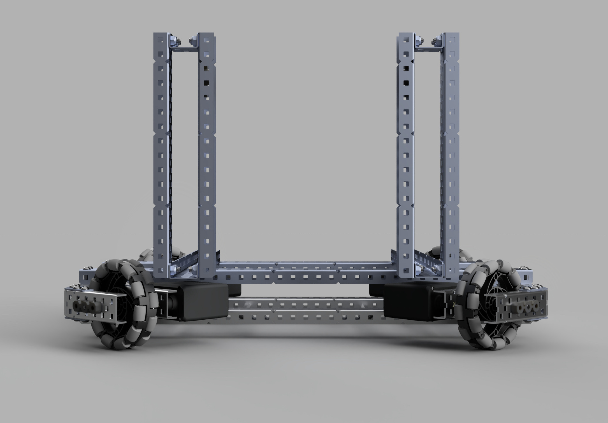
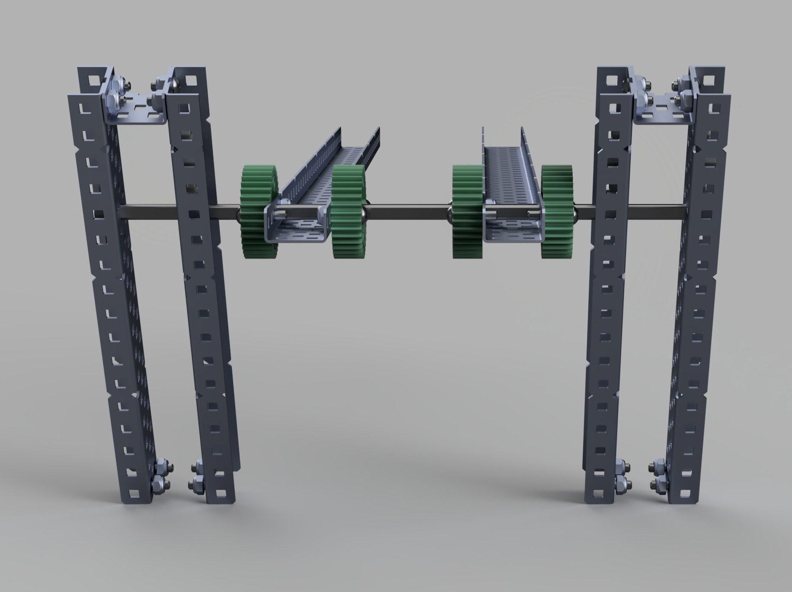

# Adding a Catapult
### Dylan Mashini
### June 12th, 2023

## How Does a Catapult Work in Vex?

Our team has never made a catapult, so we had to figure out how they function in Vex. Usually, Vex catapults are powered by rubber bands that are wound back with a motor. The way that a motor winds the catapult arm back is using a gear train. Then at the bottom of the catapult's path, the gear doesn't have teeth, and the gears lose contact. 

### Slip Gears

This idea of a gear that intentionally loses contact is called a slip gear. To make one, you take a regular Vex gear and cut away teeth. [This Vex Forum post was useful to figure out how to create our slip gears. ](https://www.vexforum.com/t/slip-gear/35759/3)

### Slip Gear Math

To figure out the number of gears to cut off, we need some math. For now, we are going to use a 60T gear attached to the motor, and 12T gears for the catapult arm. This allows us to have a big-to-small gear ratio, increasing Force and Decreasing speed. This is ideal because the retraction of the catapult arm doesn't have to be fast, it just has to be strong. 

**GEAR RATIO**:

One gear is the input (attached to the motor) and one is the output (attached to the catapult arm). 

- Let the number of teeth on the Input Gear be $I$ (60)
- Let the number of teeth on the Output Gear be $O$ (12)
- Let the number of teeth of travel on the Catapult Arm ($O$) be $T$
- Let the gear ratio be $u$

With this in mind, the gear ratio is: $$u = \frac{I}{O}$$
Now we can calculate that to make the catapult arm move by $T$ teeth, we need the input gear to move by $\frac{T}{I}$ teeth. That means that the input gear needs to move $\frac{T}{1}$ teeth before disengaging. So to know how many teeth to cut off we can use the formula: 
$$
Teeth \;to \;Cut \;Off = I-\frac{T}{I}
$$

## Using CAD to put it all together

First, I had to model the mount that the catapult arm would go on on the robot. Here is a CAD render of the mount that I made. There will be two of them attached to the sides of the robot. This is made out of steel, because it will be taking the force of the catapult, so it needs to be strong. 

After making that mount, I attached it to the existing Chassis component. 

Then I designed a Catapult Arm. This is going to have a bucket for tri-balls attached to it, but that would be too time-consuming to CAD, so, for now, it is just 2 parallel C Channels. Notice how we use gears to mount a C Channel to an axle. This is perfect because it allows us to have a slip gear directly attached to those gears to actuate the catapult. 

Figuring out how to make a slip gear in CAD was a challenge. This is the first time that I've had to use anything besides just jointing already existing vex elements together. Here is a render of one that I made for learning. (not the correct number of teeth or size of gear)

This was ultimately never used in CAD, because it was too difficult and time-consuming to assemble a geartrain, and it provided minimal benefit vs doing it in the real world. After adding the structure for the catapult, and the catapult arm, we decided that we had enough to begin building the the real world. 