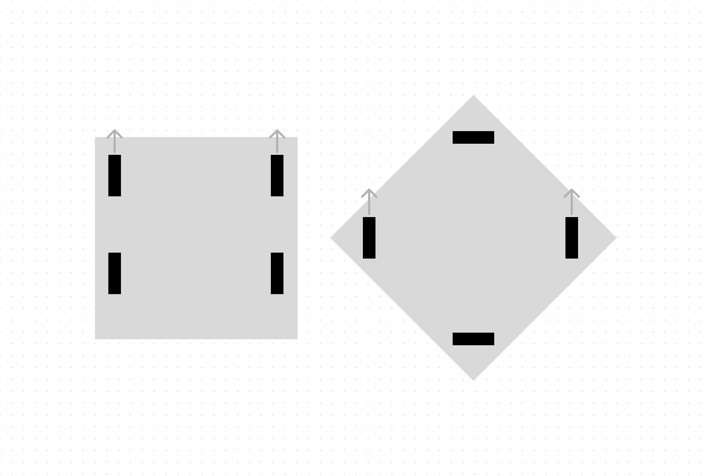
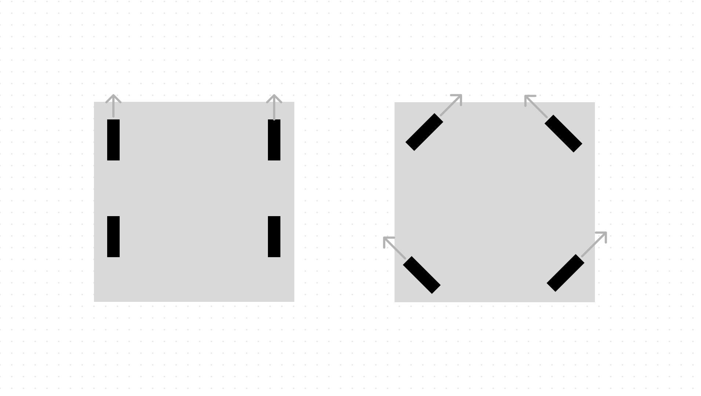

# Building the Chassis
### Ari Low
### June 16th, 2023

The chassis design looks good, and it's time to start building the chassis. Right now, there are a few things we know we need that aren't included in the CAD. 

- Odometry Wheels
- Brain Mounting
- Possible Mounting point for Air Tank

Right now I have a general idea of where these things should go, but I'll have to iterate on it to make sure that it works. 

## Building

I started by creating the inner and outer tracks of the X drive. These were pretty straightforward, but midway through we ran out of $45^\circ$ gussets. To continue being productive, I attached all 4 C Chanels together before adding the angled ends. This ended up making things more difficult when I had to put in the motors, axles, and wheels. 

### Adding Motors
One thing that the team hasn't thought about is what gear cartridges we are going to use. This was our first time making a X Drive, so we didn't have a good perspective on what would work well. Let's do some quick calculations to figure that out. 

We know that X drives go at $\sqrt{2}$ times the speed of a Comparable Tank Drive because of a vexforum post, but it isn't explained well anywhere. Many people explain it as a vector addition operation, which seems intuitive enough, but you shouldn't need that level of mathematical abstraction to explain something so simple. Let's look at some example cases to figure this out. 

First, consider a Tank Drive that is moving directly forwards compared to a X Drive moving Diagonally. 

In this scenario, both will have the same max speed, but the X drive will have less force. This is because the RPM is the same for the motors and there are motors facing directly the direction the bot needs to go in both robots. Let's look at a more common scenario where both bots are going forwards:

In this scenario, where both are traveling in the forward direction, the X drive has all 4 motors going at full RPM, but in different directions. When it balances out, you are going 1 speed unit forward, and one left. This makes it easy to represent it as a Right Triangle. 

C (the hypotenuse) is the forward direction, and we can solve using the Pythagorean theorem. 
$$
1^2 + 1^2 = C^2
$$
$$
C^2=2
$$
$$
C=\sqrt{2}
$$
This proves that when traveling forwards, an X drive will have $\sqrt{2}$ times the speed. This comes at at a cost though, because Force and Speed are inverses of each other. That means that a $\sqrt{2}$  increase in speed leads to a $\frac{1}{\sqrt{2}}$ times decrease in Force. To balance this tradeoff, we decided to use a green cartridge instead of a blue cartridge that we used last year. Let's calculate some stats using a Green Cartridge

##### Max Speed:
To calculate Max speed of an X drive, we can calculate the Max speed of the same robot with a tank drive configuration and multiply by $\sqrt{2}$. A green cartridge is 200rpm. These calculations are easier because we are using a direct drive without any gear ratio. 

- Let $v_{max}$ be the maximum speed
- Let $c$ be the circumference of the wheel

We know that in a tank drive, that:
$$v_{max} = RPM \times c$$

And in a X drive:
$$
v_{max}=RPM \times c \times \sqrt{2}
$$

With that in mind, we just have to calculate the $c$ value. We plan to use 3.25 inch omni-wheels. 3.25" refers to the diameter of the wheels, meaning that we can calculate the circumference. 
$$
r=\frac{d}{2}
$$
$$
c=\pi \times r^2
$$
$$
c = \pi \times (\frac{3.25}{2})^2
$$$$
c \approx 2.64
$$
Now we can plug that in to our formula from before:
$$
v_{max} \approx 200 \times 2.64 \times \sqrt{2}
$$
And we get:
$$
v_{max} \approx 746.70
$$

Now we have to consider units. Although $c$ is in inches, it really represents $\frac{inches}{revolution}$ in our equation, because the circumference of a wheel is the amount of travel per revolution. So when we multiply $\frac{revolutons}{minute}$ by $\frac{inches}{revolution}$, revolutions cancel and we end up with $\frac{inches}{minute}$. This is a weird unit to use for this, so we can convert it to $\frac{inches}{second}$. This also seems like a strange unit to use, but it is the easiest to verify experimentally that I can think of, it works out to a whole number, and isn't too large of a value. To get to $\frac{inches}{second}$ we have to divide $v_{max}$ by 60. 

The final value is:
$$
v_{max} \approx 12.445 \; \frac{inches}{minute}
$$

I'm planning to verify this after it is built, and see if we actually reach that max speed. 

### Constructing Wheels + Motors
To add wheels, axles, and motors, we must figure out the correct amount of spacers to use. Previously for us, this was a lot of trial and error, but now that we have a CAD model, we can use that to figure it out. 

This made it significantly easier, and the number of spacers shown fits perfectly. Now, I just have to repeat the installation process three more times. 

