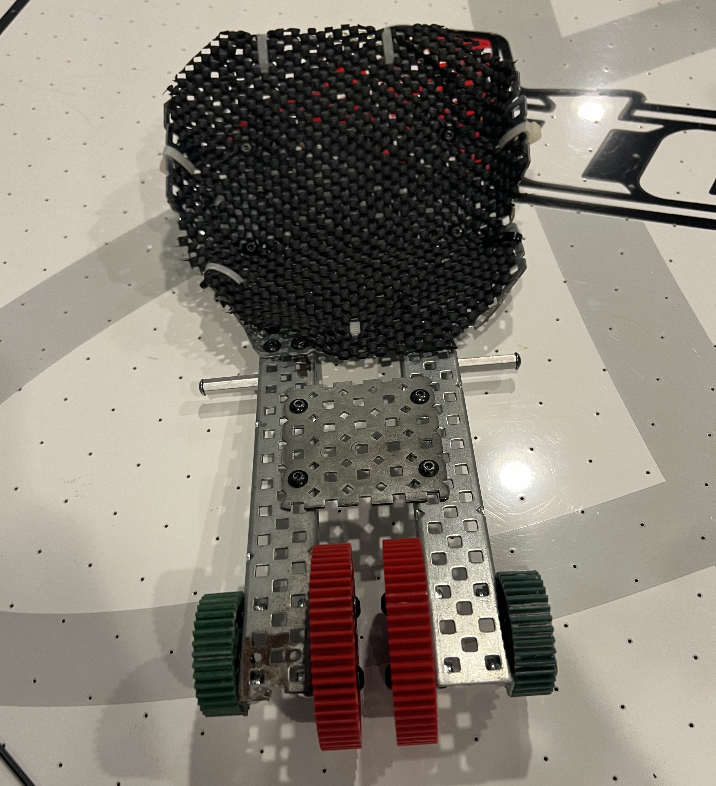
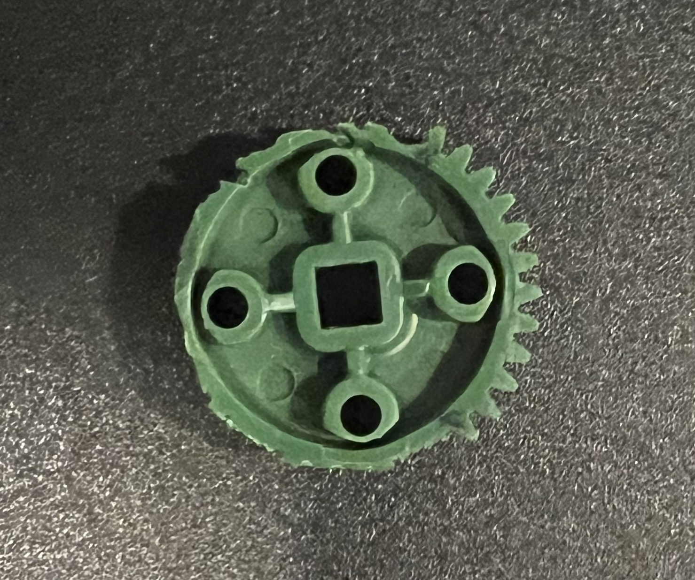

# Building The Catapult
### Ari Low
### June 23rd, 2023

To assemble the catapult, I first needed to make the catapult arm that would hold the Tri-Ball. This arm wasn't designed in CAD, and I had to bend lots of Vex metal plates to make it

This image of it has the incorrect gears, but the bucket for the Tri-Ball is the same. Notice how we wrapped it in Vex Anti-Slip mats. These are Vex-legal and allow us to increase the friction so the Tri-Ball doesn't slip out of the bucket. 

Building the catapult was the most challenging part of building that we've had to do so far. Something new that we had to learn to do was cut slip gears. Here is a picture of one of the first ones we made:

The best tool that we had to make them was a Dremel with a cutaway wheel, which is difficult to make precision cuts in plastic with. The picture shows a few gashes into the plastic where the Dremel slipped and cut away more than we wanted. We went through a few gears because we cut off too many teeth, or made other mistakes cutting, but now we are much better at cutting the gears. 

After creating the slip gears and the catapult arm, we assembled the catapult frame from the CAD model. Here is a picture of it. 

As you can see, we added a bunch of Anti-Slip mat on the hard stop of the catapult to lower the curve of the Tri-Ball so it doesn't overshoot. This worked well, and the catapult functioned after putting it all together with a red cartridge motor, and 12 rubber bands. 

## Testing
For testing the Catapult, we banded it and created a simple program. We haven't programmed the timings that we are going to use for match loads yet, but we created a simple program, where you press a button, and it winds back, pauses so you can load a tri-ball, and then goes the rest of the way. In our initial testing, the Tri-Ball was able to travel 8 feet consistently in a straight line. This is perfect because it will let us shoot across the field. 