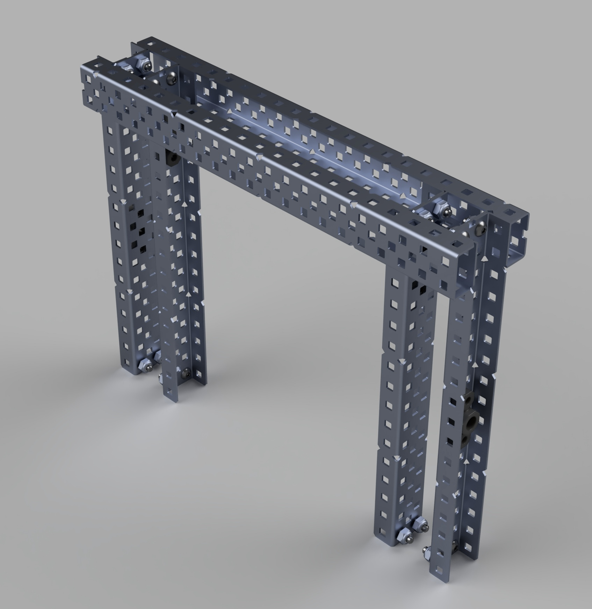
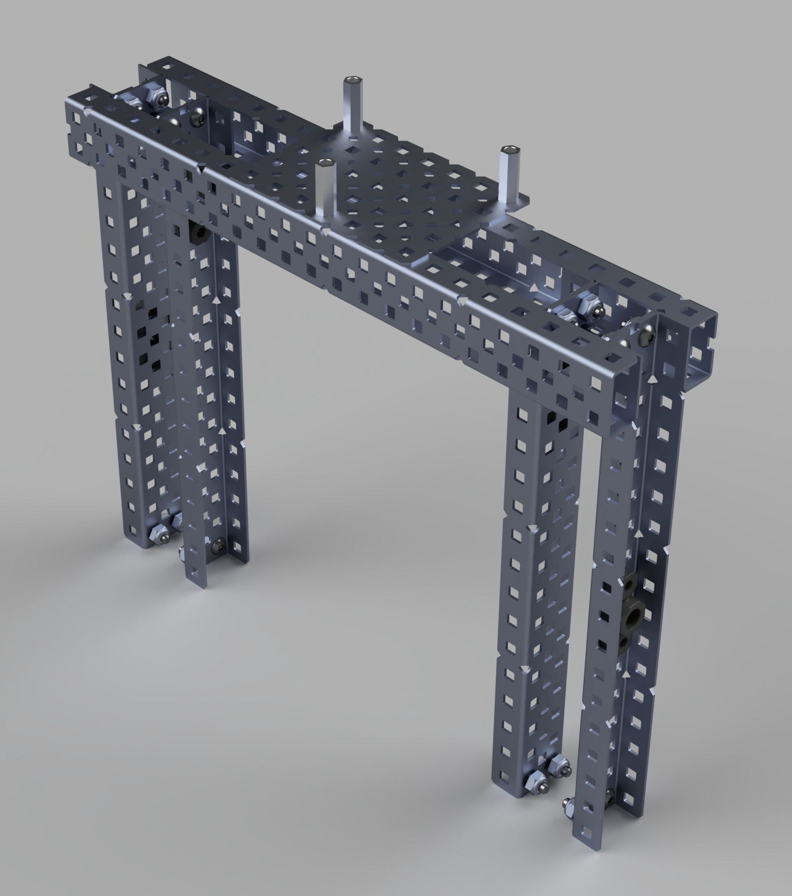
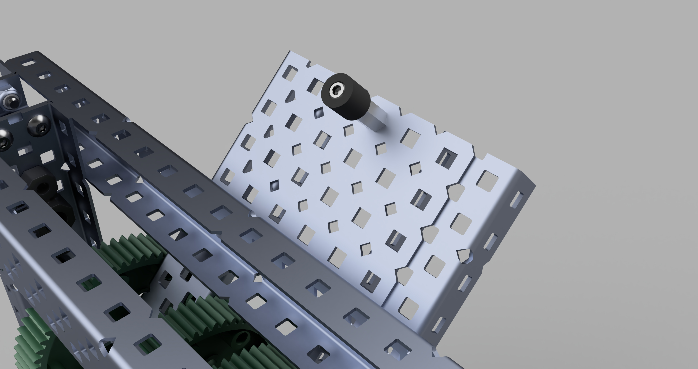
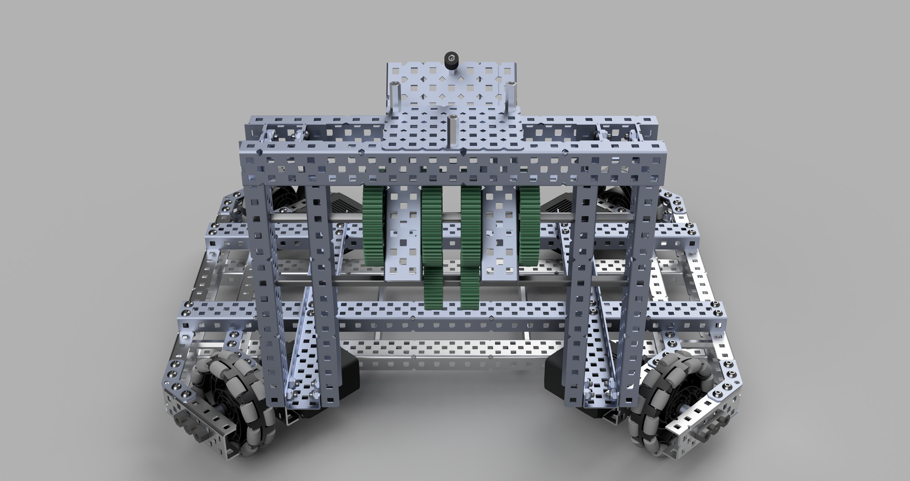

# Designing the Puncher
## Dylan Mashini

## Return To CAD!
I'm happy to announce that the team is onboard to continue designing everything in CAD. I really like this because I enjoy CAD, and also think it allows us to be more prepared. Right now, the CAD model for the robot doesn't have the Intake, but that's ok because we're planning to scrap and redesign it. 

## Puncher Design
The design for the puncher is going to be pretty simple. Essentially, we are planning to remove the catapult bucket, shorten the arms, and add a standoff to punch the Tri-Ball off of a platform above the robot. 

## Adding the platform on top

Right now, the current Catapult Frame makes it difficult to install a platform on top. To install it, first, we have to add 2 c channels that it can be mounted to. 

After that, I could add a metal plate on top for the tri-ball to mount to. I built this in real life first, so I could figure out the proper distance apart to put the standoffs for the Tri-Ball to fit nicely in. 

After finishing that, I had to add the slip gear gear. I didn't actually cut a gear, because there wasn't a good way to simulate the motion in CAD, so there wasn't any real benefit to cutting the gear in CAD. This is the first time I'm putting a geartrain in CAD, and I couldn't find any vex-specific tutorials. I found a general one that showed the process from creating a gear drawing to meshing two gears together with a gear ratio. To do this, I had to use an asbuilt revolute joint and link the motion of these joints using the gear ratio. This took a while to figure out, but it works great. Here are some pictures of the gears together. 

Now that I have the gears done, I just have to finish the puncher itself. The puncher consists of a standoff with a spacer at the end. The spacer has a screw countersunk into it, so it hits the Tri-Ball consistently. 

The way that we plan to countersink the screw into the spacer is by drilling out the spacer first. The purpose is so that the point where the puncher contacts the tri-ball is as flat as possible, creating a more consistent launch. 

This is all we need for the puncher design, and it's ready to be built. Here's a picture of it in the robot assembly. 

