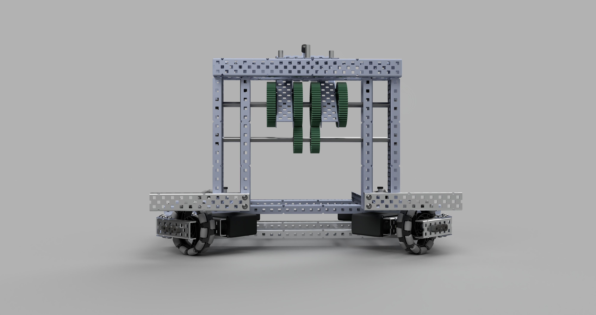

# Designing The Wings
## Dylan Mashini

In this iteration, we decided that we wanted to have wings on our robot. This is because we want to be able to push more effectively, and descore. Last competition we didn't have wings, and we just used the flat end of our X Drive chassis to score, but I think by skipping wings we left a lot of points on the table. Initially, when brainstorming the wings, we thought we would utilize the flat end of the X Drive to be the center pusher for the wings, but this wasn't feasible because we would have to store the wings on the intake and catapult side of the robot. Instead, the pusher is going to be below the catapult. This is good for a couple of reasons:
- Allows us to push with a full 36" surface
- Prevents Tri-Balls from getting stuck under the slip gear
- Allows us to store the wings on the flat ends of the robot where there isn't anything in the way

We are going to use pneumatics to actuate the wings. This has a set of its own challenges, but I think we can work through it. I have a pretty good idea of what these wings are going to look like based on what other people had last competition. Before I get into CAD, I want to test out a few ideas I have in real life. 

For pivoting our pneumatic end, previously we have used these

These worked well, but at the competition, I saw teams threading the end of the pneumatic into collars. I know that this was only possible by using the new pneumatics system that we don't have yet, but it gave me another idea. What if we drilled and tapped the correct size threads into a collar. Here's a picture of it:

It worked great for pushing and pulling, but as soon as there was some angular force on the pneumatic rod, it fell apart. I don't know why this is, but I think we will be best sticking to the normal pneumatic pivot that we had previously used. 

To start, I added C channels on the sides of the robot. These would mount the C channel that would pivot out as the wing. I had to mount them so high up, because of our X Drive chassis. The wheels get in the way of mounting them lower, and it had to be mounted to the catapult frame because the end of the chassis was at a $45^\circ$ angle. This was one of the major downsides that we anticipated using an X Drive chassis, and it did turn out to be a problem, but we were able to work through it. Having our wings higher will reduce the structural integrity of the wings, but I think that this will be manageable. 

After adding those two C channels, I added the pivoting wings. These were connected to the initial C channels with a screw joint. I chose to use a screw joint rather than an axle joint because a screw joint has significantly less slop. This will make the wing work better overall, and also make it smoother. The pivot part slightly clips with the wing's C Chanel, but this can be easily addressed when we actually build it by bending the pivot part.

After this, I had to connect the pneumatic system. I decided I was only going to put the cylinder in the CAD, because there isn't a need to put any of the tubes and other pneumatic equipment in, and it would be a waste of time to do that. I added in one of the pivot parts I was talking about earlier and jointed the piston of the pneumatic cylinder to it. 

Then, I connected the end of the piston to a standoff connected to the chassis using a screw joint. As you can see, it is a couple of millimeters off, but we plan on not tightening the nut all the way, so it should work fine. This was necessary because there isn't anywhere where the holes are going to perfectly line up, because the pneumatic cylinder is a non-standard size in the vex ecosystem. To represent this in CAD, I just left it a few millimeters off and connected them using an asbuilt joint. Asbuilt joints don't move the components but capture the position where everything was when you jointed them. 

Now all I have to do is duplicate it on the other side, and it's done. The movement works with all the joints, and I'm really happy with how it turned out. Here is the final picture of how it looks when it's extended:

And here's what it looks like when it's retracted:

As you can see, the wing sits pretty high up on the robot. This is unfortunate because of the polycarbonate usage and decrease in strength and stability, but it will still work well, and give us a good edge. Overall, I'm confident in the current wing design and think that this will create a significant competitive advantage. 