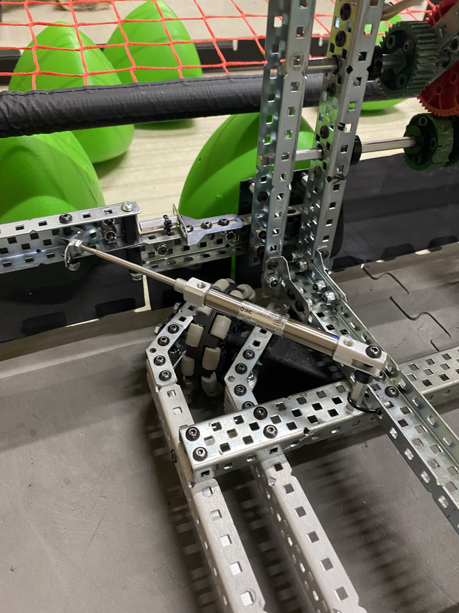

# Building The Wings
### Ari Low
### November 28th, 2023

To build the wings, I just have to copy what we have in the CAD model and add polycarbonate. This polycarb is going to be what actually pushes the Tri-Balls. 

### C Channels

For the wings, I used all Aluminum, because we wanted to keep our weight down for endgame. We have some ambitious endgame plans, so we want to save weight wherever we can.

## Polycarbonate

Right now, the team has used almost half of the polycarbonate that we bought last year. Because we are trying to budget the team and spend less this year, I decided to prototype with cardboard for this and only cut the polycarbonate out when I have the final version done. I put a piece that was already cut and used from last year that was the right dimensions for the center, but for the actual wings, I used cardboard. Here's a picture of what it looked like with one wing installed. 

Another benefit of doing this is that cardboard is much easier to cut than polycarbonate, so I can prototype much faster, and without worrying about waste. 

After finishing the build with cardboard, I cut and added the polycarb, and it looks great. 

Out of all the mechanisms that we've built, I think that the wings are going to provide the best value for the least effort to build. 