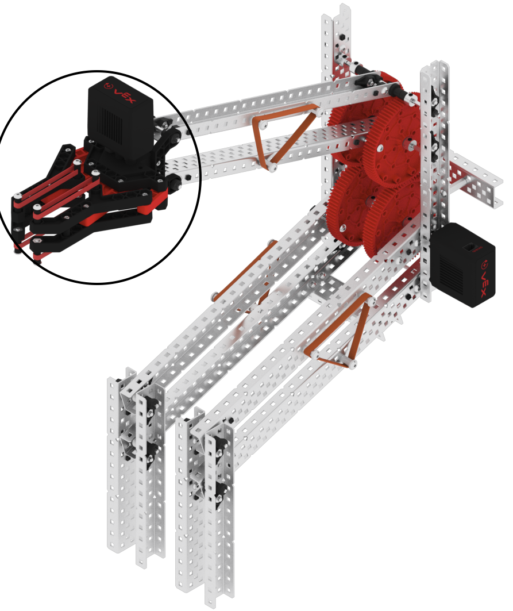
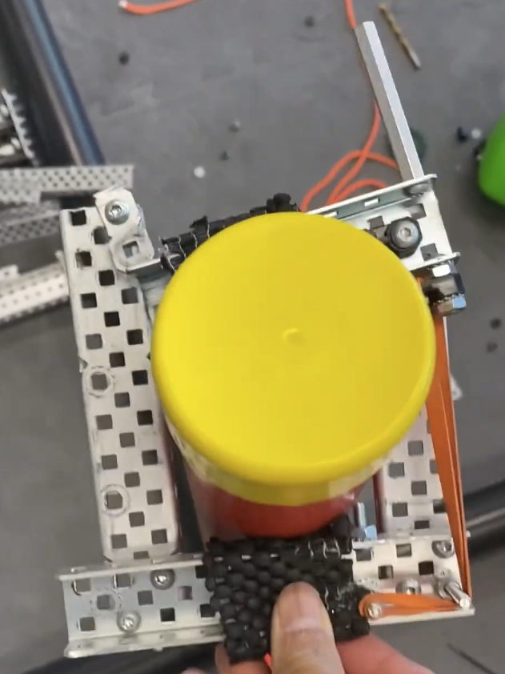
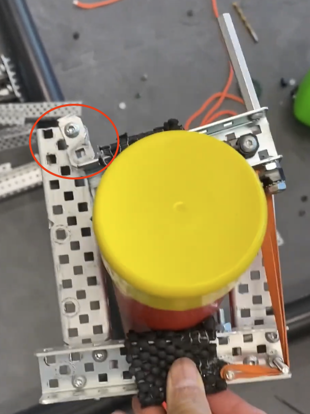

# Conquering Endgame (Part 1)

### Dylan Mashini
### December 16th, 2023

For our first iteration of the endgame, we had a few options to choose from. First was a hanging mech. We have seen this work with other teams in person, so we know that it is doable. The second option is a lift system. We haven't seen this work in person, but there are a few videos online of this working well for teams. The lift system would be harder to build, but score us a higher elevation height, and more points. 

### Lift System
The type of lift system that is best suited for the endgame challenge is called a Double Reverse Four Bar (DR4B). The idea is that it can compress to be very small by having 4 bars, two that go inwards towards the center of the bot, and 2 that reach back out, towards the front of the bot. Here's a picture of a DR4B in its lowered state. 

As you can see, it is very compressed. Despite its (relatively) low profile, a well-designed DR4B can reach very high. Here's a picture of a DR4B someone else made a few years ago fully extended. 

## Hanging Mechanism

The idea of a hanging mechanism is simple. All it does is hang the robot on the horizontal bar. This allows the robot to get off the ground, but the height that can be achieved is very limited. The upside of this type of endgame is that it is very simple. 

Although this picture posted by Vex explaining endgame appears to defy the laws of physics, the idea of hanging on the horizontal bar is still demonstrated. 

Here are some criteria that we analyzed to decide on what type of endgame to build. 

### Elevation Height
This is by far the most important category for our decision because the whole purpose of an endgame is to score us points. Getting the highest of any other teams on the field gets you 20 points, the second highest gets you 15, then 10, then 5. Getting the full 20 points in every match is the goal, so we want to design something that can **consistently** score first. 

The lift is going to get us to a significantly higher elevation, but likely there won't be that many teams that attempt, and I don't envision more than 2 teams doing endgame in any round. I envision it being the difference between 15 and 20 points in a few rounds, but the lift will certainly get us higher. 

A hanging mechanism would get us a "bottom tier" endgame, so if we're the only ones to do the endgame it still is 20 points. 

### Easy to Design
We still have a long time before the competition, but making sure we pick a **realistic** design is essential. 

The lift is going to be significantly more difficult to engineer. This is because it has much more moving parts. Although I think that it is still possible for our team to create a DR4B, it is likely going to take more than 20 hours of working to get it to function. 

To create a hanging mech, it can be pretty passive. It just needs to be a ramp that the robot drives at the horizontal bar with. This ramp will then lift the robot up, and then settle the robot hanging in the air. The one moving part of this is the deployment mechanism. Because our drivetrain isn't capable of making it over the horizontal bar, we need to be able to go under the vertical bar during the match, and then deploy a hanging mechanism that puts us on top of the horizontal bar. 

### Size
The size profile of an endgame design would be essential if we were working off of our last design, but since we decided to remove the intake, we have a lot of space to work with. It would still be ideal to have some "wiggle room", because we want to make sure that we are in size without any issues, and also make sure that the endgame doesn't interfere with our puncher. 

Creating a lift is going to take up significantly more space, but this isn't too big of a factor that we are worried about. Part of the reason a DR4B lift would take up so much space is because it expands to be so large, so the parts have to nest into each other. This effectively means that we can't sneak any mechanisms in the empty space between the lift, because the lift itself will already occupy that space. 

A hanging mechanism will take up significantly less space. 

### Compatibility
When we set out to make an endgame, we want to make sure that it won't interfere with our partner's endgame. This is difficult to do, but considering it could earn our alliance 15-20 additional points in a match, so it is an important thing to think about.

A lift endgame is likely to be compatible with more endgames at a local competition. This is because there are very few teams attempting anything more than a hanging endgame, so the vertical bar is usually free for us to utilize. 

When using a hanging mechanism, only one person can attempt to hang on the horizontal bar. This limits us to not get two teams up if the other team we are allied with also has a hanging mechanism. 

## Final Decision

Here's a decision matrix, along with what it came down to when we decided on a lift. 

| Criteria             | Weight | Lift Mechanism | Hanging Mechanism |
|----------------------|--------|----------------|-------------------|
| Elevation Height     | 10     | 10             | 8                 |
| Easy to Design       | 4      | 6              | 8                 |
| Size                 | 3      | 7              | 9                 |
| Compatibility        | 5      | 9              | 7                 |
| **Weighted Total**   |        | **236**        | **220**           |

### Elevation Height
- **Lift Mechanism**: Scores consistently high, reaching the top tier and ensuring a 20-point gain in most matches.
- **Hanging Mechanism**: Provides a solid performance but typically scores in the bottom tier, potentially missing out on the maximum points.

### Easy to Design
- **Lift Mechanism**: More complex with many moving parts, requires significant engineering and time.
- **Hanging Mechanism**: Simpler and more passive, with fewer moving parts and a quicker deployment.

### Size
- **Lift Mechanism**: This takes up more space due to its expansive design but is manageable given the available space.
- **Hanging Mechanism**: Compact and leaves room for other components and systems.

### Compatibility
- **Lift Mechanism**: Likely to be more compatible with various endgames, especially in local competitions where few attempt beyond hanging.
- **Hanging Mechanism**: Limited compatibility as it restricts the ability for multiple teams to hang simultaneously.

## Considering Design

For the design of our Double Reverse Four Bar lift, we decided to refer to the vex knowledge base. This is the image that we decided to base our lift on. We had a few modifications in mind to make it better suited for creating a lift capable of picking up the full weight of our robot. 

First, we definitely don't want to use a Vex clamp like displayed in the image (circled in black). This is because it would be unlikely to hold the weight of our robot well, and we also would prefer a passive clamp because we don't want to use a motor where one isn't necessary. This task is well suited for a passive mechanism because it only has to happen once during a match, so resetting it outside of a match is viable. Here's a picture of a clamp that we found online, that we are considering iterating off of for creating ours. 

There are a few issues that I can identify by looking at the image of the clamp. First, the band's path seems very prone to obstructions, and like it might not provide enough tension. Second, the whole thing looks crooked, which is a sign that it might not work consistently throughout a competition. Lastly, the way that this clamp locks is questionable. It takes a lot of power to just push a c Chanel past a 1x2 plate, and I just don't see how that's going to work without the plate just moving and being unable to keep the C Chanel locked.  

Here's a picture with the problematic locking mechanism I'm talking about circled. 

The only way to find out if these things are going to be problems is to actually build it and prototype though. 

