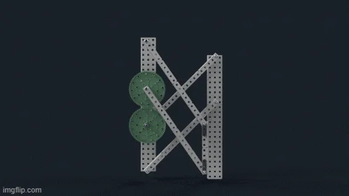
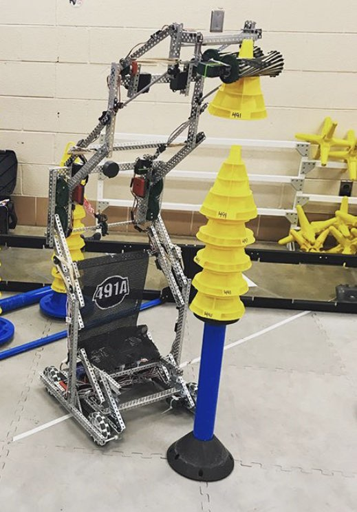
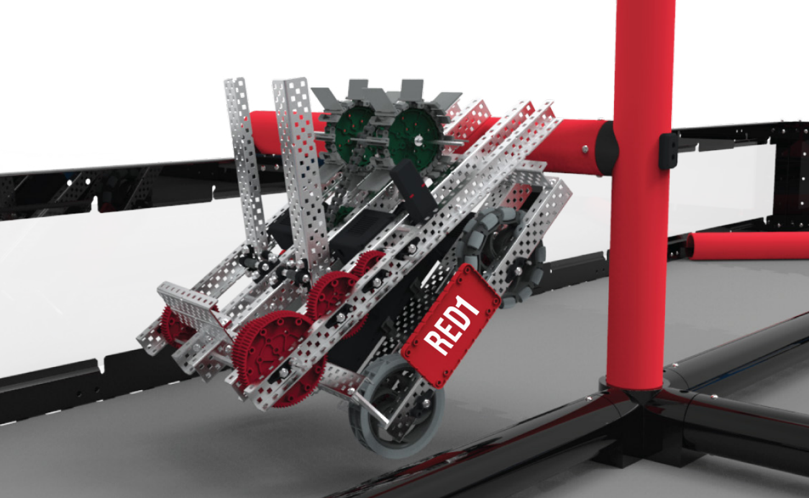

# Conquering Endgame

For our first iteration of the endgame, we had a few options to chose from. First was a hanging mech. We had seen this work with other teams in person, so we know that it is doable. The second option is a lift system. We haven't seen this work in person, but there are a few videos online of this working well for teams. The lift system would be harder to build, but score us a higher elevation height, and more points. 

### Lift System
The type of lift system that is best suited for the endgame challenge is called a Double Reverse Four Bar (DR4B). The idea is that it is able to compress to be very small by having 4 bars, two that go inwards towards the center of the bot, and 2 that reach back out, towards the front of the bot. Here's a picture of a DR4B in it's lowered state. 

As you can see, it is very compressed. Despite it's (relatively) low profile, a well designed DR4B can reach very high. Here's a picture of a DR4B someone else made a few years ago fully extended. 

## Hanging Mechanism

The idea of a hanging mechanism is simple. All it does is hang the robot on the horizontal bar. This allows the robot to get off the ground, but the height that can be achieved is very limited. The upside of this type of endgame is that it is very simple. 

Although this picture posted by vex explaining endgame appears to defy the laws of physics, the idea of hanging on the horizontal bar is still demonstrated. 

Here are some criteria that we analyzed to make a decision on what type of endgame to build. 

### Elevation Height
This is by far the most important category for our decision, because the whole purpose of a endgame is to score us points. Getting the highest of any other teams on the field gets you 20 points, second highest gets you 15, then 10, then 5. Getting the full 20 points in every match is the goal, so we want to design something that can **consistently** score first. 

The lift is going to get us to a significantly higher elevation, but likely there won't be that many teams that attempt, and I don't envision more then 2 teams doing endgame in any round. I envision it being the difference between 15 and 20 points in a few rounds, but the lift will certainly get us higher. 

A hanging mechanism would get us a "bottom tier" endgame, so if we're the only ones to do endgame it still is 20 points. 
### Easy to Design
We still have a long time before the competition, but making sure we pick a **realistic** design is essential. 

The lift is going to be significantly more difficult to engineer. This is because it has much more moving parts. Although I think that it is still possible for our team to create a DR4B, it is likely going to be more then 20 hours of working to get it to function. 

To create a hanging mech, it can be pretty passive. It basically just needs to be a ramp that the robot drives at the horizontal bar with. This ramp will then lift the robot up, and then settle the robot hanging in the air. The one moving part of this is the deployment mechanism. 
### Size
The size profile of a endgame design would be essential if we were working off of our last design, but since we decided to remove the intake, we have a lot of space to work with. It would still be ideal to have some "wiggle room", because we want to make sure that we are in size without any issues, and also make sure that the endgame doesn't interfere with our puncher. 

Creating a lift is going to take up significantly more space, but this isn't too big of a factor that we are worried about. 
### Compatibility
When we set out to make a endgame, we want to make sure that it won't interfere with our partner's endgame. This is difficult to do, but considering it could earn our alliance 15-20 additional points in a match, so it is a important thing to think about.

