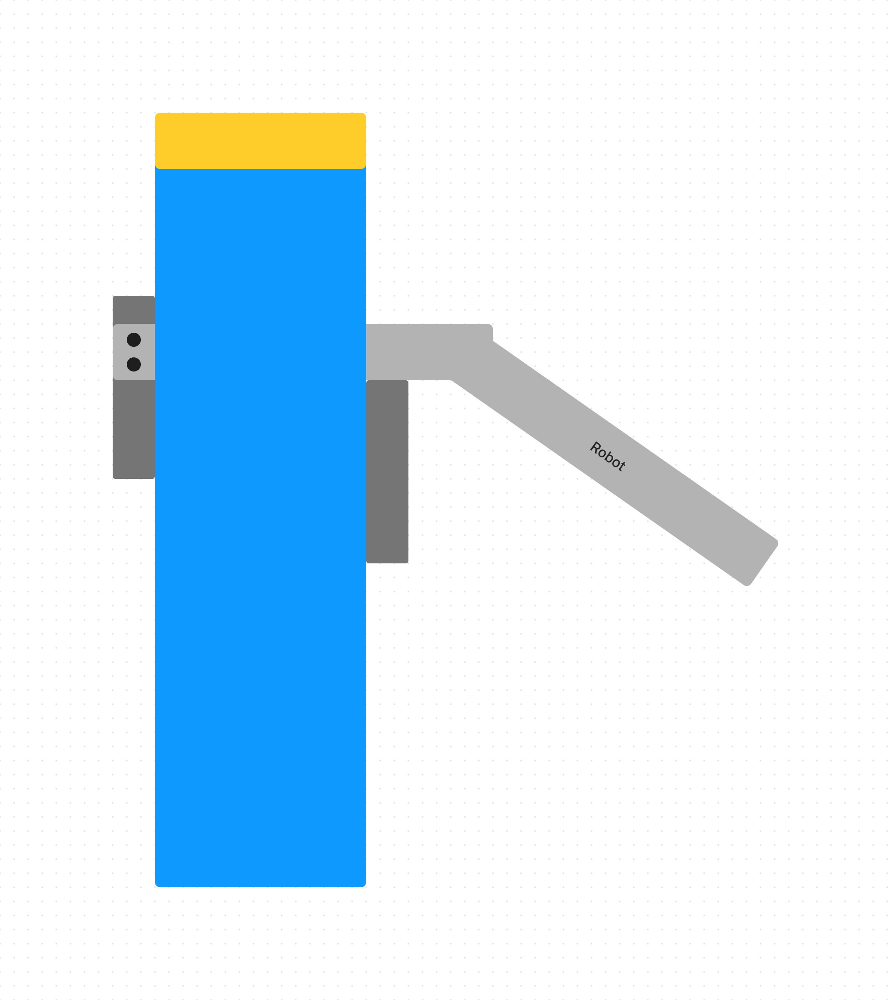
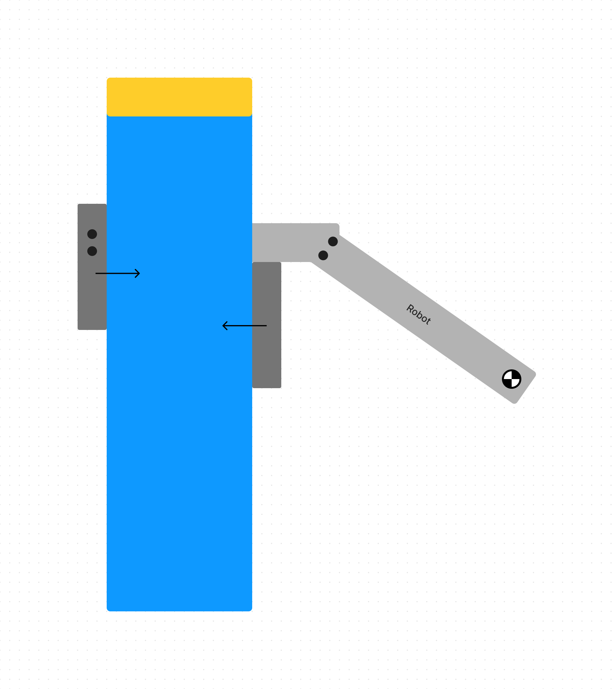
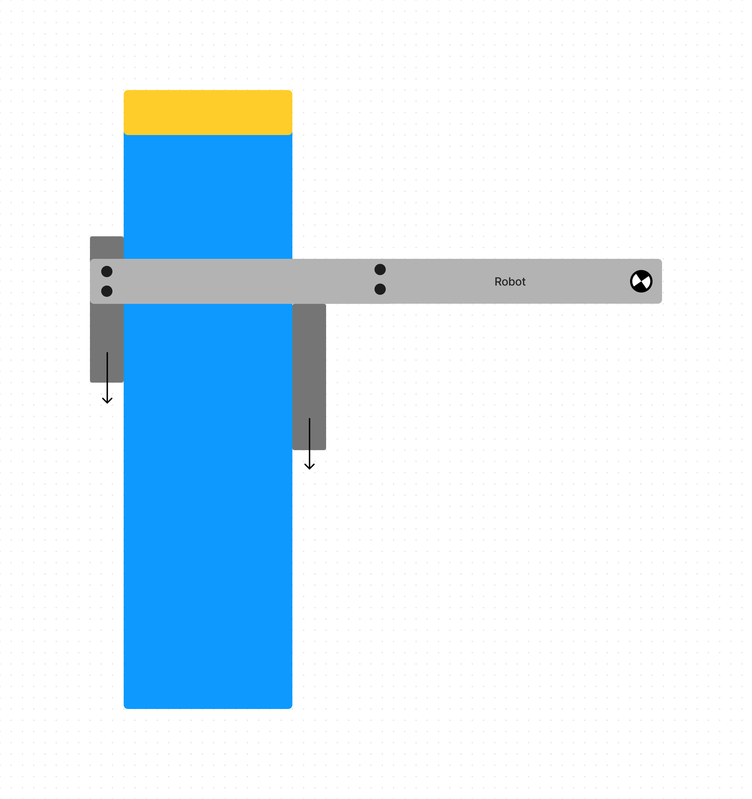

# Building Endgame
## Ari Low

I think that endgame is going to be the most complex and challenging part to build on our robot. So far, everything we've built has been smooth sailing, but I think that endgame has the potential to challenge us. 

Right. now, I'm planning to build a lift using a design that I've seen on vex's official knowledge base. I think this is a pretty safe bet, because it should be pretty reliable if vex is publishing it. To understand more and have the capability to modify the design, I've been reading and watching videos on DR4B lifts. A youtube channel called Kepler Electronics has a amazing video on them, and the Perdue SigBots wiki also has a great page on them. 

The first (and probably easiest) problem that I want to tackle is the clamp. Although this is *slightly* more trivial then the rest of the endgame system, it is still critical. There are a few things that we need to keep in mind when we design and build it. 

First, it needs to be able to handle the weight of the robot, including the whole endgame lift. This is going to be pretty heavy, so for prototyping clamps I'm going to use a 20 pound dumbell to test it's load bearing ability. 

Second, it needs to be able to handle a changing center of gravity. This is important, because the easiest solution would be some type of gravity lock, but that would struggle with the changing center of gravity. When center of gravity is far below the clamp, a gravity lock would hold fine, but as the robot's center of gravity approaches the height of the clamp, slippage becomes more likely. 

Here's a diagram I made of what I mean when I say a gravity lock:

We can verify that the change in center of gravity can be problematic using physics:

The way that this type of lock functions, is by using the weight of the robot to push into the pole on either side, allowing friction to prevent it from sliding. 

So the weight of the robot is pushing horizontally against the pole, which increases the normal force. 

We know that the maximum force that can be applied before the clamp slips is going to be equal to the maximum coefficient of static friction ($\textmu_{max}$) multiplied by the normal force ($F_N$). $\textmu_{max}$ is going to remain constant, because it is a property of the materials in contact (clamp and pole). This means that $F_N$ is going to be the primary thing that influences how effective the clamp is. For the clamp not to slip, the frictional force ($\textmu_{max} \cdot F_N$) must be greater then the force of gravity($F_g$). 

If the robot's center of gravity is aligned with the gravity lock, friction will decrease, and the robot will slip down. 

