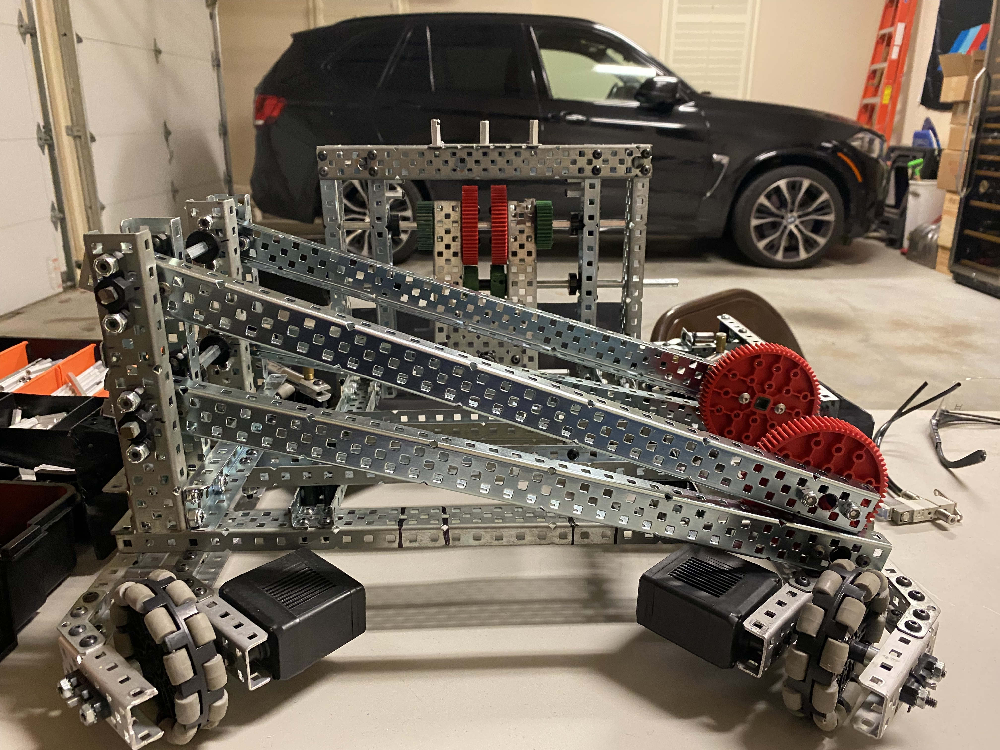
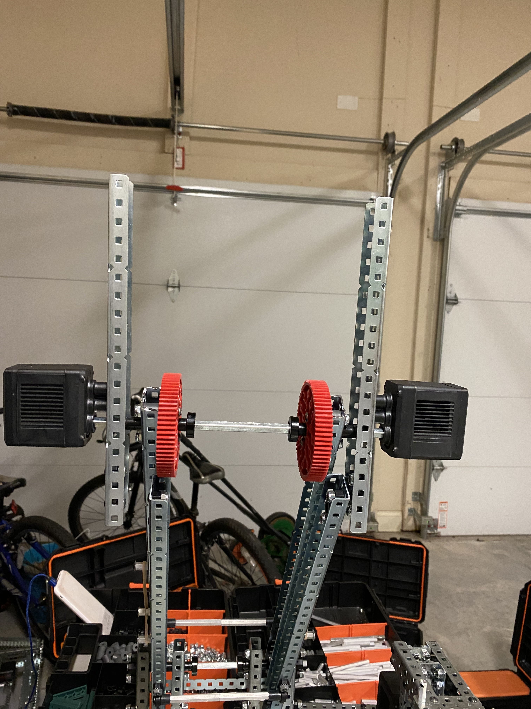
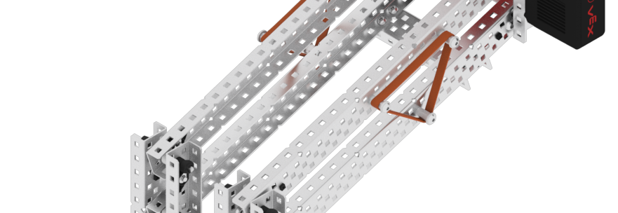
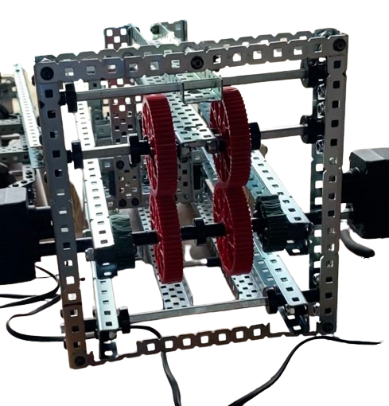
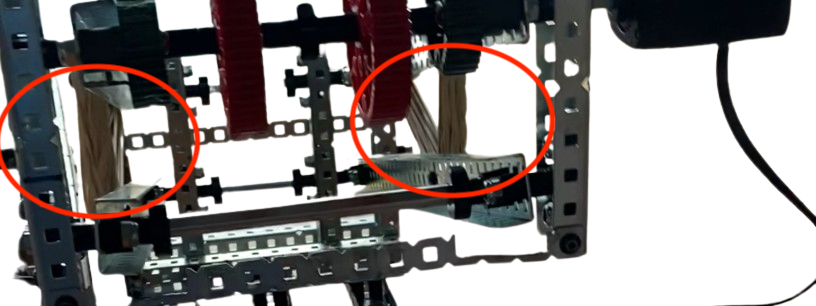

# Building Endgame
## Ari Low

I think that endgame is going to be the most complex and challenging part to build on our robot. So far, everything we've built has been smooth sailing, but I think that endgame has the potential to challenge us. 

Right. now, I'm planning to build a lift using a design that I've seen on Vex's official knowledge base. I think this is a pretty safe bet because it should be pretty reliable if Vex is publishing it. To understand more and have the capability to modify the design, I've been reading and watching videos on DR4B lifts. A YouTube channel called Kepler Electronics has an amazing video on it, and the Perdue SigBots wiki also has a great page on it. 

The first (and probably easiest) problem that I want to tackle is the clamp. Although this is *slightly* more trivial than the rest of the endgame system, it is still critical. There are a few things that we need to keep in mind when we design and build it. 

First, it needs to be able to handle the weight of the robot, including the whole endgame lift. This is going to be pretty heavy, so for prototyping clamps, I'm going to use a 20-pound dumbbell to test its load-bearing ability. 

Second, it needs to be able to handle a changing center of gravity. This is important because the easiest solution would be some type of gravity lock, but that would struggle with the changing center of gravity. When the center of gravity is far below the clamp, a gravity lock would hold fine, but as the robot's center of gravity approaches the height of the clamp, slippage becomes more likely. 

Here's a diagram I made of what I mean when I say a gravity lock:

We can verify that the change in center of gravity can be problematic using physics:

The way that this type of lock functions is by using the weight of the robot to push into the pole on either side, allowing friction to prevent it from sliding. 

So the weight of the robot is pushing horizontally against the pole, which increases the normal force. 

We know that the maximum force that can be applied before the clamp slips is going to be equal to the maximum coefficient of static friction ($\textmu_{max}$) multiplied by the normal force ($F_N$). $\textmu_{max}$ is going to remain constant because it is a property of the materials in contact (clamp and pole). This means that $F_N$ is going to be the primary thing that influences how effective the clamp is. For the clamp not to slip, the frictional force ($\textmu_{max} \cdot F_N$) must be greater than the force of gravity($F_g$). 

If the robot's center of gravity is aligned with the gravity lock, friction will decrease, and the robot will slip down. 

This is why we decided to use a locking clamp, rather than a gravity lock. We built this prototype, and it works ~80% of the time, so it's good for now. I'm sure we are going to need to improve on this, but right now I want to move onto the lift itself. 

I first built a sled for the lift to be mounted on. This sled has to be very structurally stable, as it has to support the weight of the robot. Here's a picture, and you can see the sled is attached directly to the structural bars on the chassis. 

This picture also shows the lower two bars. These two bars aren't connected yet, but I am able to prop them up with a gear. Here's what those two bars look like when they're lowered. 

Right now those two bars move smoothly, with minimal friction. 

After adding those two bars, I connected them with two C channels on the outside. I also attached a motor to the upper gear. 

As you can see, there isn't an axle connecting the lower bar yet, but when I added an axle to the lower bar, it moved well when I tested it by hand. So far everything was lining up. 

You can also see in this picture, that I added banding between, pulling them together. This assists the motors because it pulls the two bars together. 

The pattern that the Vex KB example picture had:

When extended, the bands on our inspiration most nearly form an equilateral triangle. There is a little bit of bias towards a right triangle, but overall it's closest to an equilateral triangle. Ideally, you would use a right triangle, because you want the bands to be the most stretched when the lift is down. Then, as it's raised you want the points to converge and get closer. This means that tension is higher when the lift is down, and lower when it is up. 

With this, the lower bars are almost finished, and now I just have to implement the upper two bars. These should reach back out, up over the robot, and there is going to be a clamp attached to grab onto the vertical bar. 

The upper bars looked like this after it was built:

This part of the build was done all together at team meetings, so we didn't get that many pictures. 

Unfortunately, even with it all assembled, we had one big problem. The lift was unable to get its own weight up. We tried tons of different solutions, and I can't go into detail about all of them here, but here's an overview of what we tried. 

- Gear ratio
	- Our first thought for why it couldn't get up was the motors not supplying enough power. We made sure to use red cartridges to maximize torque, but it still didn't work. So we added an external gear ratio, by connecting a 12T pinion to connect the motor to the red gears. 
	- This didn't work for two reasons. First, it wasn't able to get the weight up, despite the gear ratio. Second, after a few attempts and iterations using the gear ratio, the gears started to slip. We initially cantilevered the gears, but even after we updated it to have one axle that was supported on both sides, we still were seeing the gears slip. 
- Moving Motors to the front
	- Another solution we came up with was moving the motors to a different part of the lift. The purpose of this was to prevent the lift from having to pick up the weight of the motors. We moved the motors to the axles at the front of the lift, where the lift wouldn't have to support the weight of the motors. We also replaced some steel parts with aluminum to decrease the weight, and although this let the lift make it partially up, it still didn't work. 
- Increasing banding
	- One of the other things we tried was increasing the banding that pulled the bars together. We took this to the extreme and put 20+ bands on each side, and it still wouldn't work. Here's a picture of the amount of bands we used during a test run that we recorded. 

At this point, we had spent well over 30 hours just trying to get it to work, and there were a lot of potential solutions we prototyped that I didn't include here. We had been really hesitant to scrap it, because of how much time we had invested, but this wasn't sound reasoning. This is a perfect example of the sunk-cost fallacy, where we were avoiding cutting our losses because of how much we put into the lift. 

I wish there was a clear conclusion here about why it didn't work, or a way we could fix it, but at this point, it feels like we have tried everything for this lift. My theory on why it didn't work is that when we scaled up the four-bar lift that we saw online, we surpassed some point where this type of lift ceased to be viable. Looking back on it, a smaller more targeted lift would be ideal. It makes sense why we haven't seen any lift systems at other comps, because they are really difficult to build. 

We aren't disassembling the lift yet, and if someone on the team can get it working we'd be happy to put it back on the robot, but we are pivoting our endgame strategy for now. 

Instead of a lift, we want to make a hanging mechanism that utilizes the horizontal bar. This was a solution that we considered from the beginning, and its biggest merit is the promise of being easier to build, and more consistent. 

Overall, I can't say I'm happy with how this ended up, but I went from barely understanding how the crazy complex lifts I saw online worked, to understanding a lot more deeply. We definitely learned a lot, and hopefully, a lift will find its way back onto our robot before the end of the season. 
