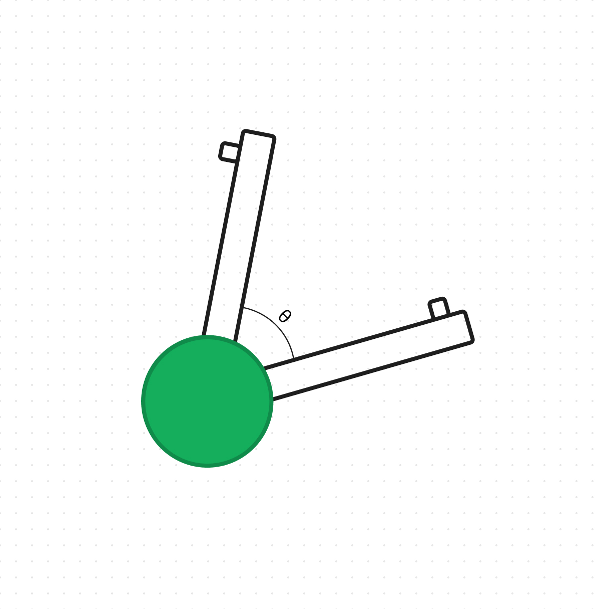

# Puncher Practice
## Julia Acker

As we approach the competition, we need to figure out how we are going to match load. Match loading is essential to the gameplay this year, and becoming highly optimized to do that quickly frees us up to be defensive much quicker. Last competition, we only had one person doing match loading, and this worked well because our catapult was pretty slow. This has changed since we pivoted to a puncher. The puncher is going to require us to use two people to load, alternating that way we don't miss any cycles. 

A important thing to consider is that two tri-balls are not able to break the plane of the field at once. This means that when we are practicing we must be extremely carful to not break this rule. If we did that during a match, it could be considered a match affecting violation. 

The two people that we decided would be best fit for match loading is Ari and me (Julia). This is because we are good at communicating, and are able to remain calm pretty well during stressful situations. We all tried match loading, and it seems like everyone is about the same baseline skill level, but as we practice I think we are going to be able to get much quicker. Another benefit of having two people match loading is that for future competitions, if someone gets sick or can't make it we have a backup. 

To start, our programmer loaded code that cycled the puncher at 75% speed. This was difficult to make each cycle, so we slowed it down to 60% and decided we would try to work our way back up. After a few times launching off all 22 without missing more then 1 cycle, we decided to speed it up to 65%. Once we mastered 65%, we decided to call it quits because it was already 11PM. I think that we'll be able to work our way up to 75%. We did some calculations to figure out what the conversion between the motor speed percentage, and the time it takes to launch all 22 of our match loads.

### Math

- Let $s$ equal the speed (as a percentage)
	- For example, if the speed was set to $75\%$, $s=0.75$
- Let $s_{max}$ equal the max speed (as rpm)
	- Right now, we are using a red cartridge in our motor with no external gear ratio, $s_{max}$ equals $100rpm$
- Let $\theta$ equal the total amount of rotation that the catapult travels in a cycle

{ width=40% }
