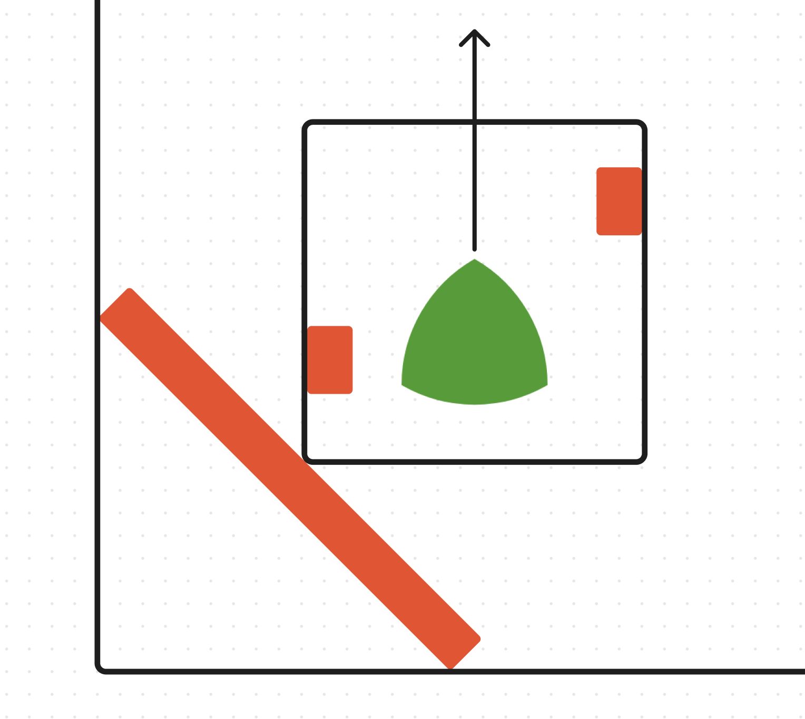
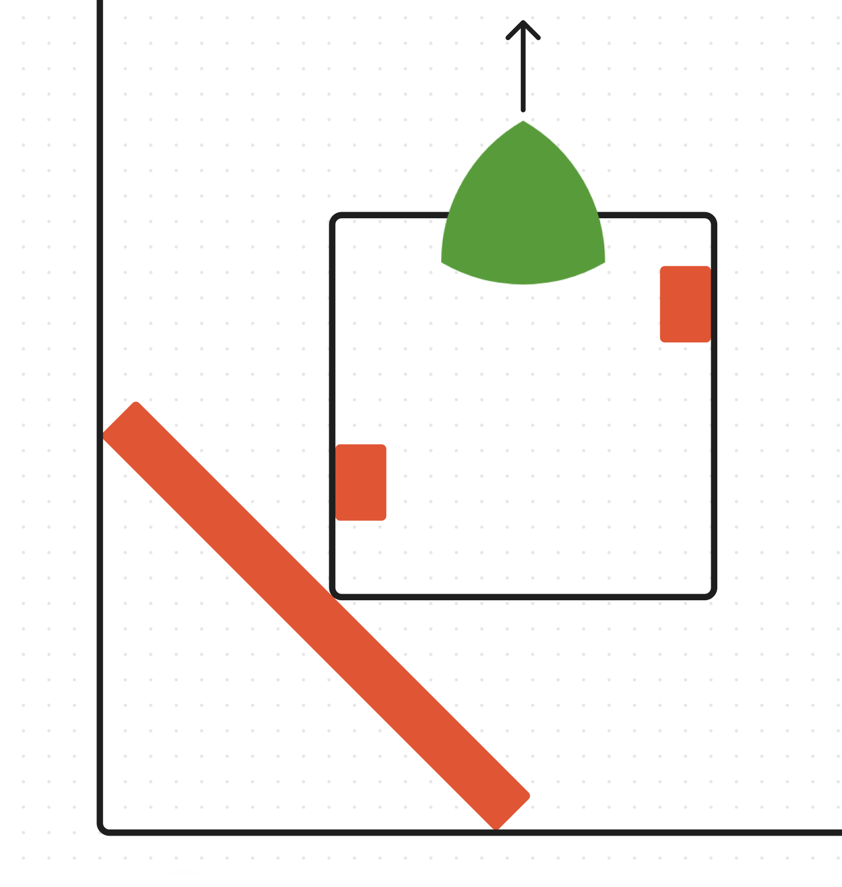
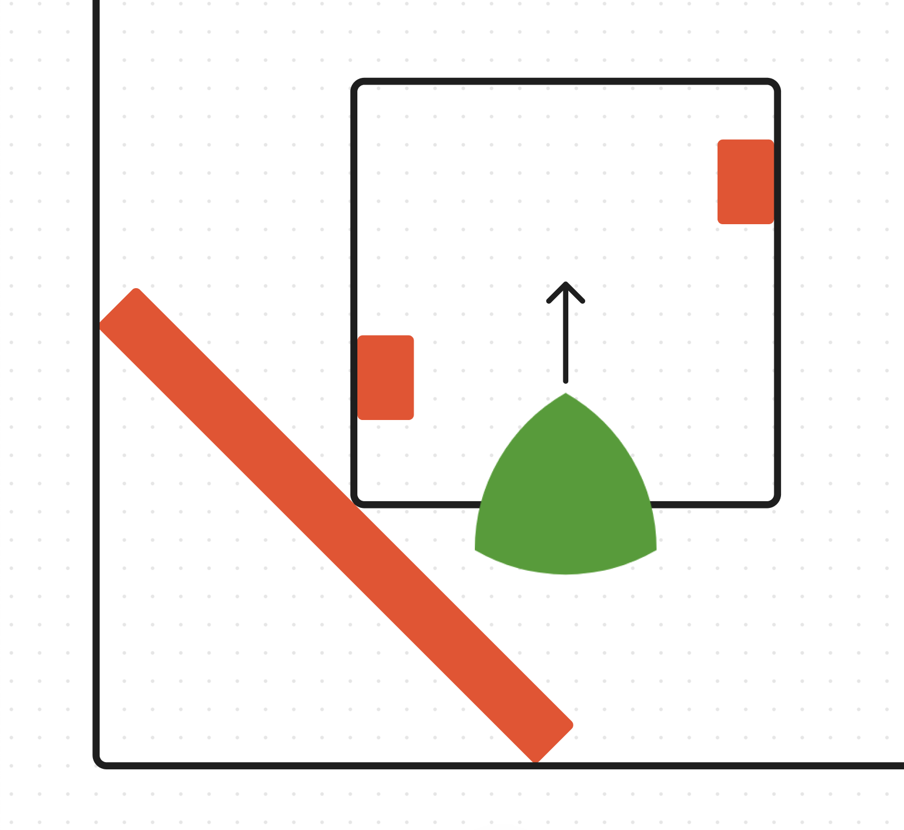

# Flipping The Puncher
### Ari Low
### December 29th, 2023

The puncher practice was mostly a success, but we realized one issue that we overlooked when converting the catapult to a puncher. The previous catapult extended across much more of the robot, taking up a much larger footprint. For that reason, it made sense to have the catapult start at the front of the robot and shoot out tri-balls forward. This is roughly where we placed the Tri-Balls when we were match-loading. 

\newpage

This was perfect, because the basket for the tri-balls was close to the walls of the field, so we could easily reach. When we changed to a puncher, we just replaced the basket with a puncher and put a spot to place tri-balls on top of the existing frame. Here's a render if you don't remember how it looked before:

If you notice, the 3 standoffs where the Tri-Ball is going to be placed are on the very front of the robot, meaning that when we match load, we have to reach across the whole body of the robot. Here's a diagram showing how match loading would work with the puncher. 

This is pretty clearly sub-optimal because our match loaders have to reach across the whole bot. This is difficult to do quickly, and would definitely slow us down. The solution is pretty simple though. All we have to do is flip the puncher $180^\circ$. If we did this, then we could "reverse" the bot into the match load bar, and then the puncher would be close to the match loaders, and would shoot in the correct direction. At this point, I don't feel like there is much of a point in making the change in CAD, because of how straightforward the change is going to be. 

After doing this, I expect us to be able to match load much quicker, and I think that the path of the Tri-Balls won't be changed significantly, because we maintained the same angle, and we can redo the tuning process to figure out how many rubber bands we need to have. Here's a final diagram of what launching is like after we flipped the puncher. 

There is one issue that I overlooked when considering changing the way that the puncher is mounted. To flip the puncher, we also have to move it backward on the robot to stay within our size constraints. Moving the puncher frame backward would impact the mounting of the wings. Because the wings are currently mounted to the puncher frame, we will need to find a new way to mount them. The wings are currently mounted using the C Channels attached to the Puncher Frame, which you can see in this render. 

We need a new mounting point for those C Channels. Fortunately, we can just use standoffs to extend those out. When we move the puncher frame back, we would put the same distance of standoffs between the puncher frame and the wing C Channels. This should give us plenty of structural stability, and still allow us to mount everything where we want it to be. 

Overall, moving the puncher was a success, here's a picture of how it turned out, and I'm pretty happy with the outcome. 