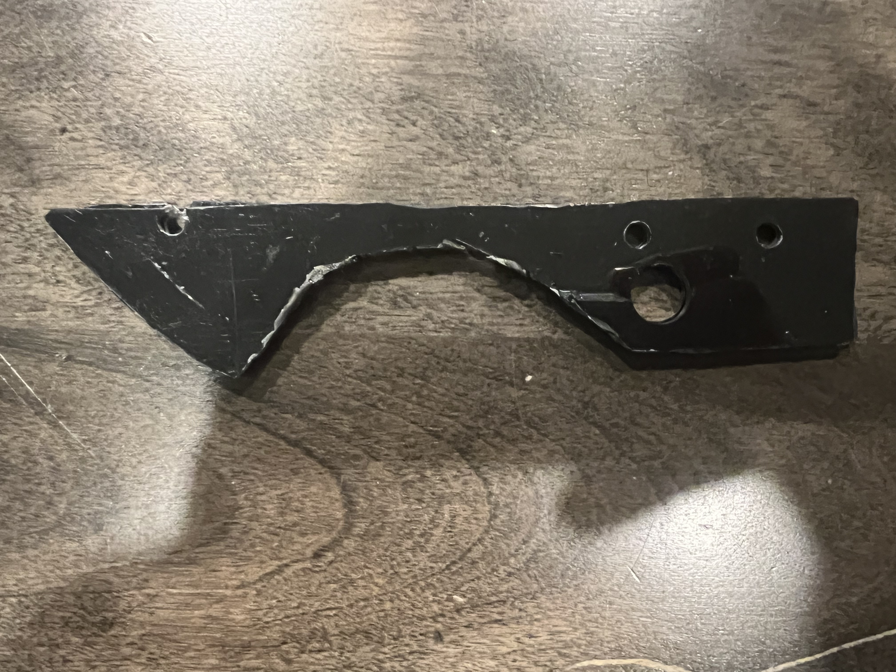
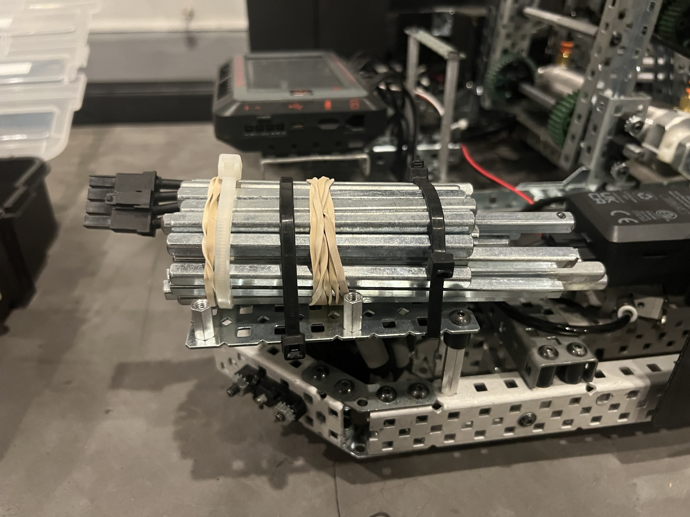
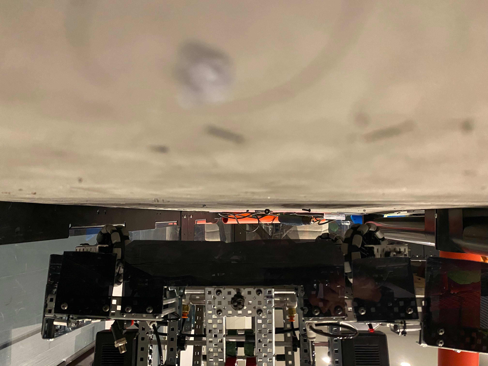
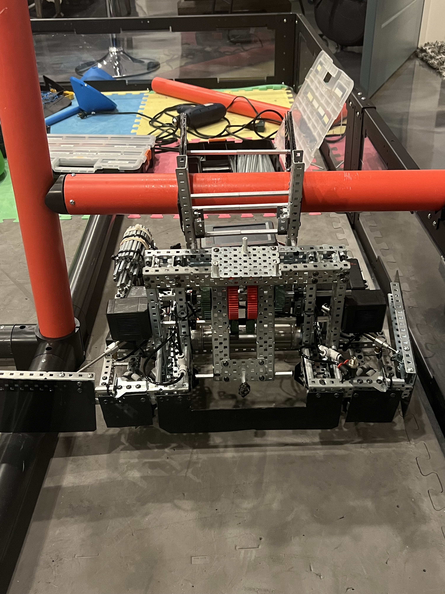

# Conquering Endgame (Part 2)
### Julia Acker
### January 14th, 2024

After pivoting from our idea of a lift-based endgame, we are planning on a more realistic endgame. This endgame is supposed to be as simple as possible while getting us off the ground. 

### Research
I haven't seen many good reveal videos online showcasing hanging mechanisms that aren't baked into the robot. When I say baked in, I mean as a part of some other critical mechanism. Some designs I heard about from our last competition involved having a ramp that you rammed into the horizontal bar. This seems pretty easy to design. The alternative uses a motor to "hug" the horizontal bar to elevate the robot. This seems harder to engineer, and our goal with this is to create something much more passive. 

### Biggest Constraint

Our biggest constraint in designing this is going to be height. Because our chassis is unable to clear the bar in the center of the field, we need to design our endgame to be able to be able to go under the horizontal bar. This means that we are going to need to retract and extend our endgame. Essentially, we can have two "ramps" that elevate our robot on a bar that a motor extends and retracts. Here is what the ramps I'm talking about look like: 

These can be cut out of polycarbonate, and reinforced by steel plates. 

The one shown above was for testing, so we made it out of some scrap polycarb. We realized that we had to make it taller, so it could get our robot higher off of the ground. To do this, we traced the first iteration ramp onto a piece of paper and then cut out a better shape. This turned out well, and here is the stencil that we made. 

After attaching those to the bot, and creating the pivot for them to be retracted and extended, we tested them. Surprisingly, they almost worked on the first try. The front two wheels were up, but the back two were still on the ground. 

When we saw this, we realized that almost all the weight of our robot was in the puncher. This made it very difficult to balance. We had one idea that could help mitigate this. If when we are hanging, we extend one of our wings to help elevate our robot, it could get the two wheels off the ground. This worked for one of the wheels, but we still had one that was stubbornly on the ground. 

If we had more time, we could redesign parts of our robot to make sure that it has a more balanced center of gravity. Because we only have a short amount of time left before our next competition, the next best solution is adding counterweights. We had 2 ideas for counterweights. 

- High Strength Axles
	- Pros: Very dense, and easy to bundle together
	- Cons: We don't have a lot of already cut axles, so we'd have to cut our "stock" axle into smaller pieces, potentially wasting material we might need in the future. 
- Low Strength Axles
	- Pros: Easy to bundle together, can fit more tightly in a constrained space, already have abundance of cut parts 
	- Cons: Less Dense

A good idea for right now is to figure out how much weight we need using bundles of low-strength axles, and then after we are sure that counterweights will work, we can cut high-strength axles. 

After figuring out the correct amount of weight we needed, we mounted it at the far corner of our robot, so it could have the greatest effect. 

Here's what the ballast looks like. If we had more time, we could definitely make it look better, but for now, it's going to be functional but ugly. 

After all of this, here is it hanging (disregard how messy the field is, this picture was taken after hours of working on it):

As you can see, with the wing out to support some weight, the robot has plenty of clearance from the ground. One thing to consider is how much the wing bends holding the robot's weight, but that's ok as long as we tighten the screws in between matches. 

Here is another angle of the robot hanging:

