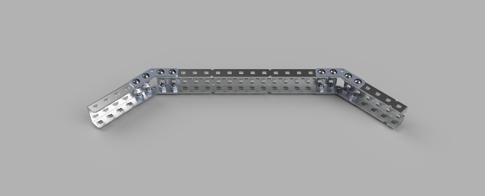
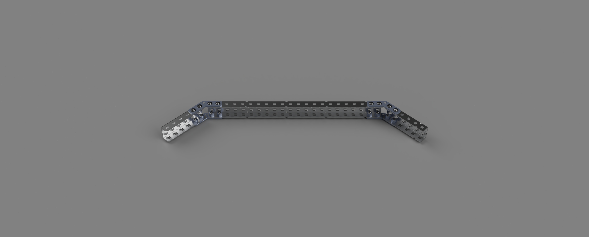
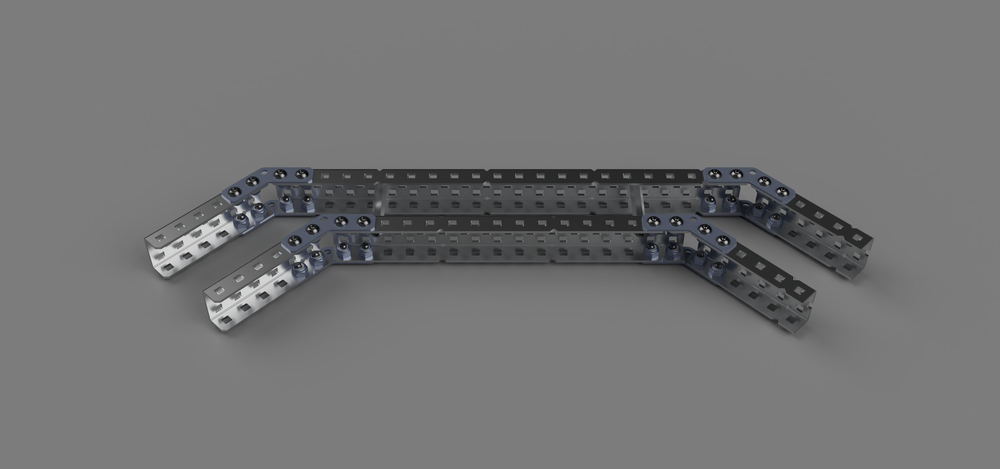
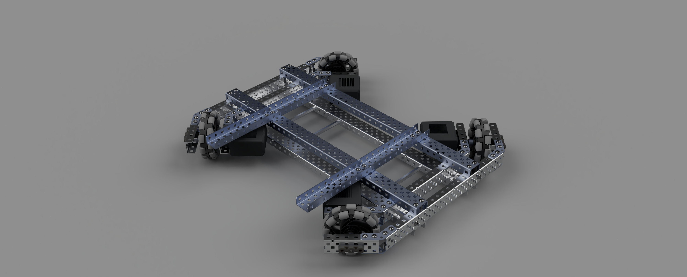
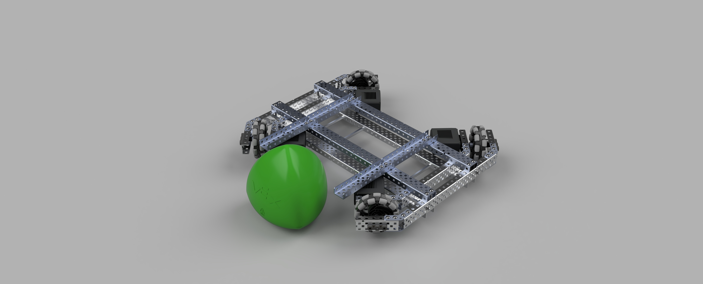

# Designing a X Drive

Right now, we have no experience with holonomic drives or CAD, so we decided it would be a good idea to learn both at once. The first decision that we had to make is what CAD software to use. We have access to all Autodesk products through their education license, so we have lots of choices. Based on vex library compatibility, we have the option to use Inventor or Fusion 360. My OS of choice is MacOS, and Inventor doesn't have Mac support. Because I'll probably be the main CAD designer, that makes the decision easy. 

## Learning Fusion 360

To learn fusion 360, I used a few resources:

- Vex CAD discord
- Kepler Electronics Youtube
- Trial and Error

These all proved useful, and using CAD for our drivetrain has definitely led to a better design then if we just threw something together like we previously would've done. 

## X Drive Inspiration
After looking through all the X drive designs we could find on the internet, this is the one that we want to take inspiration from. There isn't any videos of it actually working, or really any information about it online except for this picture, but it looks the cleanest and best. It doesn't have a heavy and bulky external frame, and is leaner then other designs. 

#### Math

We need to make sure that the holes on the inner and outer tracks are aligned so we can fit an axle through it at the ends. This actually is more difficult then it sounds, because it won't just naturally lineup. Both the size of standoffs between the tracks and the length of the different parts impact if the holes will lineup. 

To ensure that the inner and outer tracks of the chassis design align at the angled ends, we can set up a relationship based on the known parameters.  

**Defining Variables:**

Let $L_i$ be the length of the inner track's central c chanel. 

Let $L_o$ be the length of the outer track's central c chanel.

Let $\theta$  be the angle at which the tracks are angled relative to a horizontal axis

Let $d$  be the distance between the inner and outer track at the base (the length of the required standoff). 

**Relationships:**

The height change due to the angle for both the inner and outer tracks can be found using trigonometry.  

Inner Track:$$ \Delta h_i = L_i \times \tan(\theta) $$

Outer Track: $$ \Delta h_o = L_o \times \tan(\theta) $$
**Alignment Condition:**
For the tracks to align at the angled ends, the height difference due to the length and the height difference due to the angle must be equal:  $$ \Delta h_o - \Delta h_i = \Delta h $$ $$
d=\frac{\Delta h}{2}
$$
This gives:  $$ \tan(\theta) \times (L_o - L_i) = \Delta h $$  If we set theta at 45 degrees (gussets we plan to use), the above relationship becomes:  $$ \Delta h_i = L_i \times 1 $$ $$ \Delta h_o = L_o \times 1 $$  Substitute in the height changes:  $$ 1 \times (L_o - L_i) = \Delta h $$ This equation provides the relationship between the lengths of the inner and outer tracks' central metal pieces $L_i$ and $L_o$ and the change in height $\Delta h$ the tracks to align at a 45-degree angle.  We know that $d = \frac{\Delta h}{2}$, so we can solve for $d$

#### Applying The Math
We know that we want to have our Total Length as close to 18in as possible. Here are some values that will accommodate that. 
$L_i=8 in$
$L_o=11in$

With that in mind, we can find the correct distance of standoff, $d$
$$
 \Delta h = (L_o - L_i)
 $$
 $$
 \Delta h = 11 - 8
$$

$$
 \Delta h = 3
$$
$$
d=1.5
$$

This is perfect, because we can use $1.5in$ standoffs to separate the inner and outer track. These parameters are good to calculate so we can know that our holes are going to line up for the axle, and we can mitigate friction. 

## Cadded Design
After figuring out the optimal dimensions, we created different sub assemblies. First, I created a inner and outer track

### Inner Track

### Outer Track

And then connected them into a side assembly. 

### Side Assembly

### Assembly
After creating the side assemblies, I brought them into a final assembly and mirrored them. Then I added Motors, Wheels and structural Supports. Because being lightweight is very important this year, the only steel parts are the central braces. The rest is made up of aluminum. The reason that we used steel for the central parts is to reduce flex between the two sides which will prevent drive issues in the future.  

Here is the assembly with the Tri-Ball next to it. This really shocked the team because until this point we didn't fully come to terms with how large this year's game element was. 

