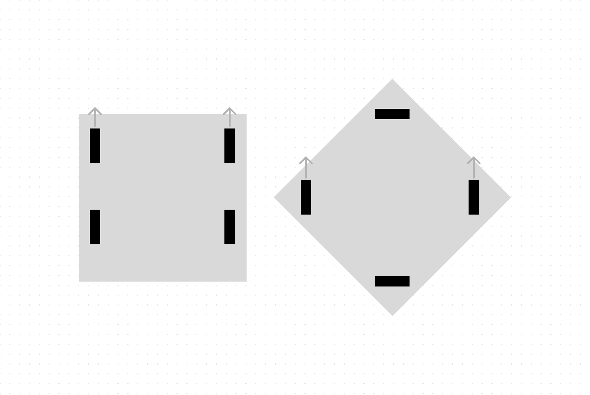
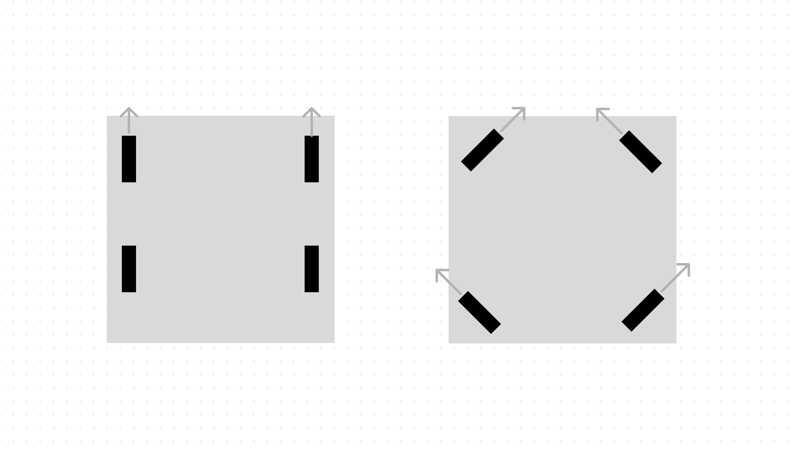
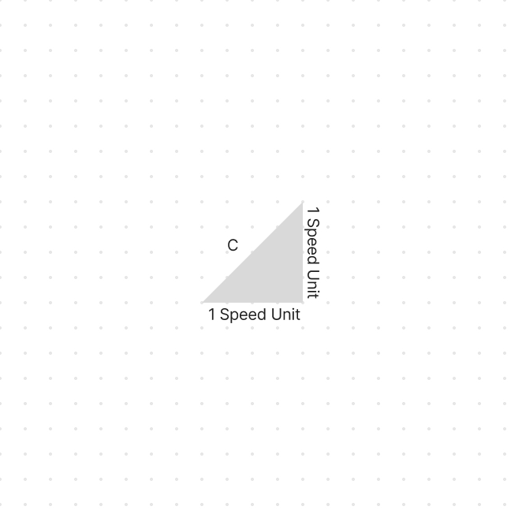

# Building the Chassis
### Ari Low

The chassis design looks good, and it's time to start building the chassis. Right now, there are a few things we know we need that aren't included in the CAD. 

- Odometry Wheels
- Brain Mounting
- Possible Mounting point for Air Tank

Right now I have a general idea of where these things should go, but I'll have to iterate on it to make sure that it works. 

## Building

I started by creating the inner and outer tracks of the X drive. These were pretty straightforward, but midway through we ran out of $45^\circ$ gussets. To continue being productive, I attached all 4 C Chanels together before adding the angled ends. This ended up making things more difficult when I had to put in the motors, axles, and wheels. Here's a render of what the bot looked like after attaching the 4 C Chanels. 

**INSERT RENDER**

### Adding Motors
One thing that the team hasn't thought about is what gear cartridges we are going to use. This was our first time making a X Drive, so we didn't have a good perspective on what would work well. Let's do some quick calculations to figure that out. 

We know that X drives go at $\sqrt{2}$ times the speed of a Comparable Tank Drive because of a vexforum post, but it isn't explained well anywhere. Many people explain it as a vector addition operation, which seems intuitive enough, but you shouldn't need that level of mathematical abstraction to explain something so simple. Let's look at some example cases to figure this out. 

First, consider a Tank Drive that is moving directly forwards compared to a X Drive moving Diagonally. 

In this scenario, both will have the same max speed, but the X drive will have less force. This is because the RPM is the same for the motors and there are motors facing directly the direction the bot needs to go in both robots. If you flip the X drive $45^\circ$ the result will be the same. Let's look at a more common scenario

In this scenario, where both are traveling in the forward direction, the X drive has all 4 motors going at full RPM, but in different directions. When it balances out, you are going 1 speed unit forward, and one left. This makes it easy to represent it as a Right Triangle. 

C (the hypotenuse) is the forward direction, and we can solve using the Pythagorean theorem. 
$$
1^2 + 1^2 = C^2
$$
$$
C^2=2
$$
$$
C=\sqrt{2}
$$
This proves that when traveling forwards, an X drive will have $\sqrt{2}$ times the speed. This comes at at a cost though, because Force and Speed are linearly correlated. That means that a $\sqrt{2}$  increase in speed leads to a $\frac{1}{\sqrt{2}}$ times decrease in Force. To balance this tradeoff, we decided to use a green cartridge instead of a blue cartridge that we used last year. 